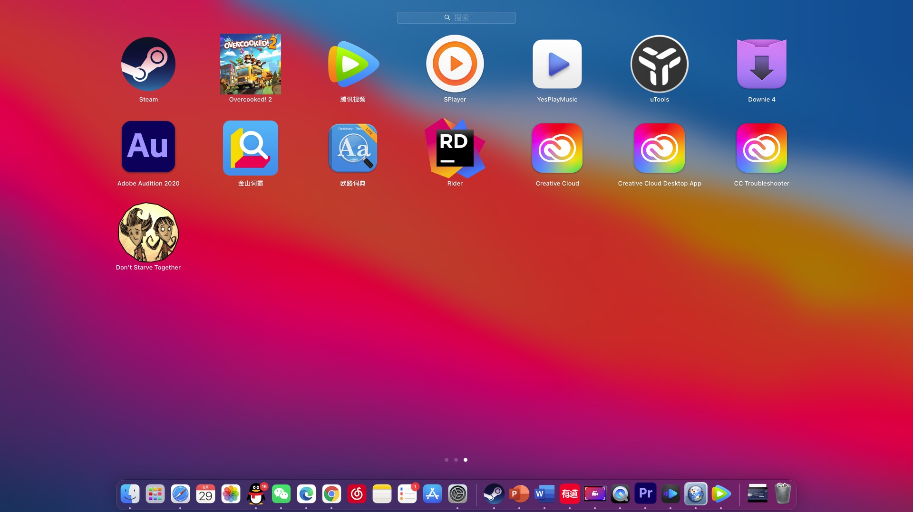

## Homework

Welcome! The main content of the assignment is in this file, if you want to back to README.md, please [click here](README.md).

#### OK, let's start!

Firstly, we need two kinds of titles. One is
## H2 sized header
and another is
#### H4 sized header

If you want to search something, [this external web](https://www.baidu.com/) may help you.

If you want to go back to homepage, you can click **"click here"** which is on the first paragraph.




emmm...There seems to be no difference between the two pictures. But it doesn't matter.

```Python
# This is a simple "Hello world" python code snippet
print("Hello world!")
```

This is a bulleted list.
* aha!
* yahaha!
* aluoyaha!

This is a numbered list.
1. xi!
2. xixi!
3. xixiha!

This is a table.
fruit|fruit|a lot of fruit
:---:|:---:|:---:
orange|tangerine|grapefruit

*italicized text*

**bolded text**

***bolded and italicized text***

~~strikethrough text~~

----
****

That's all. Have a good day!
